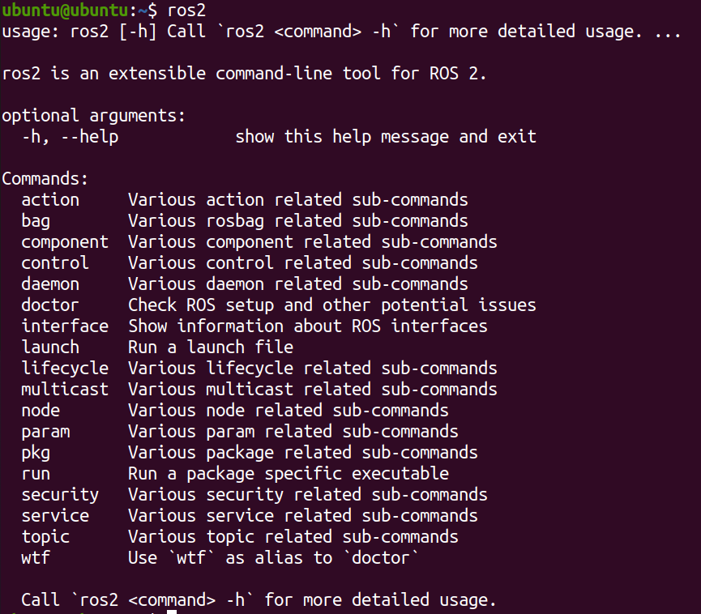

# [ROS](https://github.com/ros2/ros2/releases) 自动化安装脚本

```bash
wget http://fishros.com/install -O fishros && bash fishros
```

## 一、概述
本脚本专为在 Ubuntu 系统上自动化安装 ROS（机器人操作系统）而设计，提供了用户友好的交互界面，支持多种 ROS 版本的选择，能自动检测系统环境、优化镜像源、管理密钥、安装核心组件、配置环境变量、创建桌面快捷方式、设置开机自启等功能，并在安装完成后进行验证和功能测试，最后给出相应提示和常见问题解决建议。


### 二、[Ubuntu 版本](https://ubuntu.com/about/release-cycle)与 [ROS2 版本](https://docs.ros.org/en/kilted/Releases.html)对应关系一览表


| Ubuntu 代号        | Ubuntu 版本  | LTS     | 发布时间     | 生命周期结束   |
|--------------------|-------------|---------|--------------|----------------|
| Xenial Xerus       | 16.04       | ✅      | 2016-04   | 2021-04     |
| Bionic Beaver      | 18.04       | ✅      | 2018-04   | 2023-04     |
| Focal Fossa        | 20.04       | ✅      | 2020-04   | 2025-04     |
| Jammy Jellyfish    | 22.04       | ✅      | 2022-04   | 2027-04     |
| Kinetic Kudu       | 22.10       | ❌      | 2022-10   | 2023-07     |
| Lunar Lobster      | 23.04       | ❌      | 2023-04   | 2024-01     |
| Mantic Minotaur    | 23.10       | ❌      | 2023-10   | 2024-07     |
| Noble Numbat       | 24.04       | ✅      | 2024-04   | 2029-04     |


| ROS2版本           | LTS | 发布时间   | 生命周期结束 | 对应Ubuntu版本     | 兼容性说明                                   |
|--------------------|--------|------------|----------------|---------------------|----------------------------------------------|
| Ardent Apalone     | ❌   | 2017.12    | 2018.12        | Ubuntu 16.04        | 首个版本，功能有限，工具链不成熟             |
| Bouncy Bolson      | ❌   | 2018.07    | 2019.01        | Ubuntu 16.04/18.04  | 支持 Python 3，通信机制增强                  |
| Crystal Clemmys    | ❌   | 2018.12    | 2019.07        | Ubuntu 18.04        | 引入 ament_cmake，编译效率提升               |
| Dashing Diademata  | ✅   | 2019.05    | 2021.05        | Ubuntu 18.04        | 首个 LTS，API 初步稳定，支持 Cyclone DDS     |
| Eloquent Elusor    | ❌   | 2019.11    | 2020.11        | Ubuntu 18.04/20.04  | 增强实时性，参数服务器优化                   |
| Foxy Fitzroy       | ✅   | 2020.06    | 2023.05        | Ubuntu 20.04        | API 完全稳定，默认 Cyclone DDS               |
| Galactic Geochelone| ❌   | 2021.05    | 2022.11        | Ubuntu 20.04        | 引入组件节点，分布式通信优化                 |
| Humble Hawksbill   | ✅   | 2022.05    | 2027.05        | Ubuntu 22.04        | 支持 C++17/Python 3.10，加密通信增强         |
| Iron Irwini        | ❌   | 2023.05    | 2024.11        | Ubuntu 22.04        | 生命周期节点完善，调试工具增强               |
| Jazzy Jalisco      | ✅   | 2024.05    | 2029.05        | Ubuntu 24.04        | 支持 C++20，AI/ML 工具集成（如 TensorRT）    |


### 📌 脚本支持的 Ubuntu 版本


- Ubuntu 22.04
- Ubuntu 24.04


## 三、使用方法


在终端中执行以下命令：
```bash
chmod +x ros2.sh
./ros2.sh
```


按照提示操作
- **自定义安装参数**：询问是否要自定义安装参数，输入 `y` 可选择 ROS 版本，输入 `n` 则使用最新版本进行安装。
- **选择安装类型**：可选择基础安装或全部安装，默认全部安装。
- **优化系统镜像源**：询问是否优化系统镜像源，输入 `y` 会自动测试并选择最优镜像源。
- **选择 ROS 镜像源**：自动测试可用的 ROS 镜像源，并提供选择最优镜像源的选项。
- **环境配置**：询问是否将 ROS 环境变量写入 `.bashrc`、是否创建常用工具的快捷方式、是否设置 ROS 后台服务开机自启动。


## 四、脚本功能详细介绍
### 1. 系统信息显示
脚本会显示当前时间、系统版本和系统处理器信息，方便用户确认系统环境。

### 2. ROS 安装状态检测
检查系统中是否已安装 ROS，若已安装，提供覆盖安装、卸载后安装、跳过安装并继续配置三种操作选项。

### 3. 用户交互选择 ROS 版本
支持用户自定义选择 ROS 版本，若输入的版本不支持或与当前系统不兼容，会提示用户重新输入。

### 4. 镜像源优化
- **系统镜像源**：提供阿里云、清华、华为云等镜像源供测试，自动选择最优镜像源并更新系统。
- **ROS 镜像源**：测试多个 ROS 镜像源，根据响应时间排序，用户可选择默认最优镜像源或指定排名编号的镜像源。

### 5. 安装 ROS 核心组件
根据用户选择的 ROS 版本和安装类型，安装相应的核心组件，并在安装过程中显示进度条。安装完成后会验证安装结果，并安装额外依赖。

### 6. 密钥管理
添加 ROS 安全密钥，若添加失败会提示检查网络连接。

### 7. 环境配置
- **环境变量设置**：可选择将 ROS 环境变量写入 `.bashrc`。
- **桌面快捷方式创建**：可选择创建常用工具的桌面快捷方式，如 RViz、Gazebo 等。
- **开机自启动设置**：可选择设置 ROS 后台服务开机自启动。

### 8. 安装后验证
检查核心命令、环境变量和服务状态，若有问题会给出相应提示。

### 9. 功能测试
测试 ROS 节点通信、RViz 可视化和小乌龟仿真，若测试失败会提示可能的原因。

### 10. 最终提示
根据安装验证结果给出相应提示和常见问题解决建议，若安装成功会提示执行 `source ~/.bashrc` 命令。

## 五、日志文件
脚本会将安装过程中的信息记录到 `install.log` 文件中，方便用户查看和排查问题。

## 六、注意事项
- 运行脚本前请确保系统已联网，且具备 sudo 权限。
- 若在安装过程中遇到问题，可查看 `install.log` 文件获取详细信息，或参考最终提示中的常见问题解决建议。
- 部分功能（如桌面快捷方式创建、功能测试）可能需要图形界面支持，请确保系统具备相应环境。


验证安装

ros2 # 

echo $ROS_DISTRO  # 安装版本
echo $AMENT_PREFIX_PATH # 安装 

ros2 doctor # 


# 检查核心工具（命令行、节点管理等）
ros2 pkg list | grep "ros2cli"  # 应显示 ros2cli
ros2 pkg list | grep "demo_nodes"  # 应显示 demo_nodes_cpp/demo_nodes_py
ros2 pkg list | grep "rclcpp"  # C++客户端库
ros2 pkg list | grep "rclpy"   # Python客户端库
# 检查RQt工具（可视化界面）
ros2 pkg list | grep "rqt"  # 应显示 rqt、rqt_gui、rqt_graph 等
ros2 pkg list | grep "rviz2"  # 3D可视化工具，应显示 rviz2
# 检查Gazebo与ROS 2的接口包
ros2 pkg list | grep "gazebo_ros"  # 应显示 gazebo_ros、gazebo_ros_pkgs 等
# 检查导航2和SLAM包
ros2 pkg list | grep "navigation2"  # 应显示 navigation2、nav2_*
ros2 pkg list | grep "slam_toolbox"  # 应显示 slam_toolbox
ros2 pkg list | grep "cartographer"  # 若安装Cartographer，应显示相关包
ros2 pkg list | grep "turtlebot3"  # 应显示 turtlebot3、turtlebot3_gazebo 等


## 七、学习 ROS2


- [动手学ROS2](https://fishros.com/d2lros2foxy/#/)
- [鱼香ROS社区](https://fishros.org.cn/forum/)
- [ROS2 中文网](http://ros2.fishros.com/)





| 子命令（Command） | 核心用途 | 关键场景 |
|-------------------|----------|----------|
| `action`          | 管理 ROS 2 Action 通信 | 长时间任务（导航、抓取）的目标发送与状态查询 |
| `bag`             | 录制/回放 ROS 2 话题数据 | 数据复现、离线调试、算法测试 |
| `component`       | 管理动态加载组件 | 模块化节点设计（多个组件共享一个进程） |
| `daemon`          | 控制 ROS 2 守护进程 | 节点发现、通信基础服务的启停与状态检查 |
| `doctor`          | 诊断 ROS 2 环境配置 | 排查环境变量、依赖、网络等问题 |
| `interface`       | 查看消息/服务/Action 类型 | 查询接口定义（如 `std_msgs/msg/String` 的字段） |
| `launch`          | 运行启动文件 | 批量启动节点、设置参数、配置重映射 |
| `lifecycle`       | 管理生命周期节点 | 规范节点状态切换（初始化→活跃→关闭） |
| `multicast`       | 测试/配置多播通信 | 多机通信时验证网络多播支持 |
| `node`            | 管理 ROS 2 节点 | 查看节点列表、信息，停止节点 |
| `param`           | 管理节点参数 | 设置/获取/删除参数（如机器人轮子半径） |
| `pkg`             | 管理 ROS 2 功能包 | 创建包、查看包路径、列已安装包 |
| `run`             | 运行单个节点（可执行文件） | 单独启动一个功能包中的节点 |
| `security`        | 配置 ROS 2 安全通信 | 加密、认证、授权（防止数据泄露/篡改） |
| `service`         | 管理 ROS 2 Service 通信 | 「请求-响应」式交互（如查询机器人位置） |
| `topic`           | 管理 ROS 2 Topic 通信 | 「发布-订阅」式交互（如传感器数据传输） |
| `wtf`             | `doctor` 的别名 | 快速诊断环境问题（口语化命令） |


https://fishros.com/d2lros2foxy/#/chapt2/2.4%E5%8A%A8%E6%89%8B%E7%8E%A9ROS2
https://fishros.com/d2lros2foxy/#/chapt4/4.1ROS2%E8%AF%9D%E9%A2%98%E4%BB%8B%E7%BB%8D
https://fishros.com/d2lros2foxy/#/chapt4/4.2%E8%AF%9D%E9%A2%98%E9%80%9A%E4%BF%A1%E5%AE%9E%E7%8E%B0(Python)


## 🧱 一、基础命令验证
```bash
ros2  # 查看所有可用命令
```


## 📡 二、通信机制验证（话题发布与订阅）
```bash
# 终端1：发布话题
ros2 run demo_nodes_py talker

# 终端2：订阅话题
ros2 run demo_nodes_py listener
```
> 验证ROS2的发布/订阅机制是否正常工作。

---

## 🐢 三、Turtlesim仿真验证（图形界面+键盘控制）
```bash
# 终端1：启动小乌龟仿真
ros2 run turtlesim turtlesim_node

# 终端2：启动键盘控制器
ros2 run turtlesim turtle_teleop_key
```
> 验证图形界面、键盘控制、话题交互。

---

## 🎮 四、Gazebo仿真环境验证 

Gazebo 启动时会默认从官方服务器（models.gazebosim.org）下载场景模型（如桌子、地面、机器人模型等），而这些服务器在国内访问速度极慢，甚至超时，导致启动卡住（看似无进度）。
模型下载卡住（90% 的情况）


Gazebo 启动时会从网上下载模型，如果网络不好或者被墙，下载会很慢甚至卡住。用户可能不知道 Gazebo 默认会从国外服务器下载模型，国内网络访问这些服务器可能不稳定，导致启动停滞。
```bash
# 启动空的Gazebo仿真环境 
ros2 launch gazebo_ros gazebo.launch.py
```

---

## 🤖 五、TurtleBot3仿真与控制验证
```bash
# 终端1：设置模型并启动仿真环境
ros2 launch turtlebot3_gazebo turtlebot3_world.launch.py

# 终端2：启动键盘控制器
ros2 run turtlebot3_teleop teleop_keyboard
```


---

## 🧠 七、SLAM验证（SLAM Toolbox）
```bash
# 终端1：启动仿真环境
ros2 launch turtlebot3_gazebo turtlebot3_world.launch.py

# 终端2：启动SLAM系统
ros2 launch slam_toolbox online_async_launch.py use_sim_time:=True

# 终端3：键盘控制机器人移动建图
ros2 run turtlebot3_teleop teleop_keyboard

# 终端4：建图完成后，保存地图到指定目录
mkdir -p ~/turtlebot3_maps  # 创建地图保存目录
ros2 run nav2_map_server map_saver_cli -f ~/turtlebot3_maps/my_map --ros-args -p use_sim_time:=True
```
---

## 🧭 六、导航与地图验证（Navigation2）
```bash
# 终端1：启动仿真环境
ros2 launch turtlebot3_gazebo turtlebot3_world.launch.py

# 终端2：启动导航系统
ros2 launch turtlebot3_navigation2 navigation2.launch.py use_sim_time:=True map:=~/turtlebot3_maps/my_map.yaml

```
---

## 👁️ 八、RViz2可视化验证
```bash
# 启动RViz2
rviz2

# 或使用TurtleBot3默认配置启动RViz2
ros2 run rviz2 rviz2 -d $(ros2 pkg prefix turtlebot3_description)/share/turtlebot3_description/rviz/model.rviz
```

---

## 🧪 九、话题、服务、参数、动作验证命令（推荐测试）
```bash
ros2 topic list         # 查看所有话题
ros2 topic echo /cmd_vel  # 查看速度指令话题内容
ros2 service list       # 查看所有服务
ros2 param list         # 查看所有参数
ros2 action list        # 查看所有动作接口
```

---

